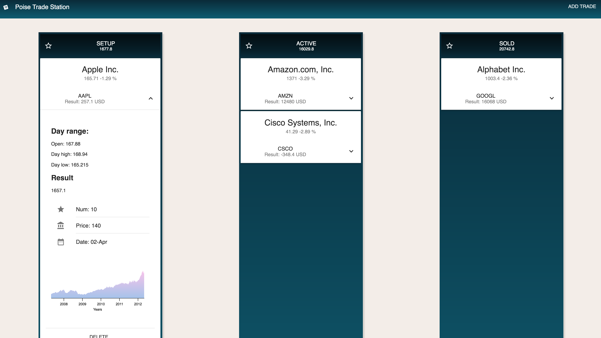

# Poise Trade Station

## What is Poise Trade Station?
Poise Trade Station is a intuitive graphical interface to manage your trade positions using drag and drop to keep track of stocks you buy and sell. It provides real time quote updates through a third party API.

## Tech Stack:

### Front-end:
* React
* Redux
* VX.js

### Back-end: (https://github.com/nikwib/poise-trade-server)
* Koa
* MongoDB
* Mongoose
* MySQL
* Sequelize
* Yahoo Finance API

## Screenshots:

    </img>
  

